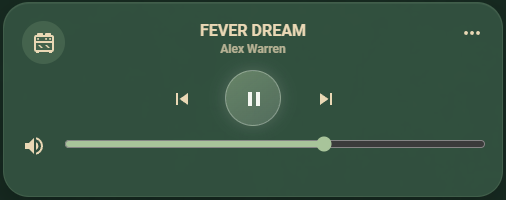
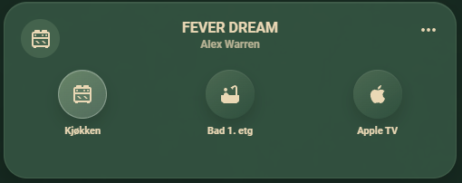

# Nature Media Player Card

A compact, nature-inspired Lovelace custom card for Home Assistant media
players. It lets you collect multiple media players in one card, automatically
follow the latest active player, and quickly switch between players with the
three-dot button.

## Preview

<p align="center">
  
</p>

<p align="center">
  <em>Media player with info, controls and volume adjustment.</em>
</p>

<p align="center">
  
</p>

<p align="center">
  <em>Switch between players.</em>
</p>

## Install With HACS

1. Open HACS in Home Assistant.
2. Go to the three-dot menu and choose **Custom repositories**.
3. Add this repository:

```text
https://github.com/vintage8902/nature-media-player-card
```

4. Choose category **Dashboard**.
5. Install **Nature Media Player Card**.
6. Reload Home Assistant or refresh your browser.

HACS should add the Lovelace resource automatically. If it does not, add this
resource manually:

```yaml
url: /hacsfiles/nature-media-player-card/nature-media-player-card.js
type: module
```

## Install Manually

Copy `dist/nature-media-player-card.js` to:

```text
/config/www/community/nature-media-player-card/nature-media-player-card.js
```

Add it as a Lovelace resource:

```yaml
url: /local/community/nature-media-player-card/nature-media-player-card.js
type: module
```

## Example

No helper sensor or input select is required. The card finds the latest active
player from the configured `players` list and remembers the last active or
manually selected player in the browser.

```yaml
type: custom:nature-media-player-card
players:
  - entity: media_player.kjokken
    name: Kjokken
    icon: mdi:stove
  - entity: media_player.bad_1_etg
    name: Bad 1
    icon: mdi:bathtub
  - entity: media_player.living_room
    name: Apple TV
    icon: mdi:apple
```

Tap the three-dot button on the card to manually choose a player. Starting
playback or changing track on another configured player will automatically move
the card to that player.

The card also includes a visual Lovelace editor for the common options:
players, names, icons, empty title, and colors.

## Colors

The default colors match the nature-inspired green/cream style, but every main
color can be adjusted from YAML:

```yaml
type: custom:nature-media-player-card
colors:
  surface: rgba(60, 94, 74, 0.72)
  border: rgba(168, 196, 154, 0.13)
  accent: "#A8C49A"
  light: "#E9F1E8"
  text: "#EAD8B5"
  muted: rgba(234, 216, 181, 0.72)
  icon_background: rgba(168, 196, 154, 0.16)
  choice_background: linear-gradient(145deg, rgba(168,196,154,0.22), rgba(46,79,61,0.58))
  active_background: linear-gradient(145deg, rgba(168,196,154,0.45), rgba(233,241,232,0.18))
  active_border: rgba(233, 241, 232, 0.32)
  active_text: "#F4F7F1"
players:
  - entity: media_player.kjokken
    name: Kjokken
    icon: mdi:stove
```

Optional advanced values are `shadow` and `active_glow`.
