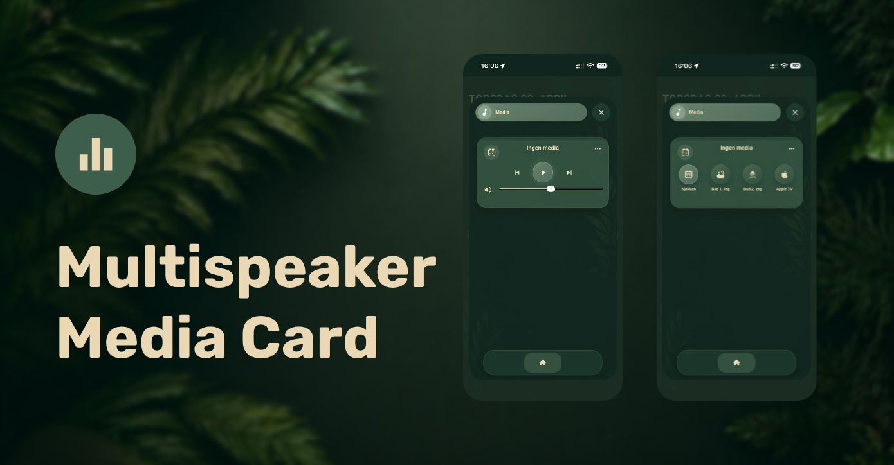
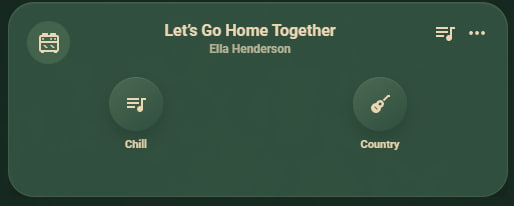

# Nature Media Player Card

A compact, nature-inspired Lovelace custom card for Home Assistant media
players. It lets you collect multiple media players in one card, automatically
follow the latest active player, and quickly switch between players with the
source icon.

## Preview

<p align="center">
  
</p>

<p align="center">
  <em>A compact multi-speaker media card with playback controls, volume adjustment and quick player switching.</em>
</p>

## Features

- Control multiple media players from one compact Lovelace card
- Automatically follows the latest active player
- Switch players manually with a built-in player picker
- Optional Music Assistant playlist picker
- Optional Spotify playlist picker
- Volume slider with mute/unmute support
- Optional Shuffle/Repeat control
- Optional cover art between track info and controls
- Visual Lovelace editor
- Custom icons, names and colors


## Install With HACS

1. Open HACS in Home Assistant.
2. Go to the three-dot menu and choose **Custom repositories**.
3. Add this repository:

```text
https://github.com/vintage8902/nature-media-player-card
```

4. Choose category **Dashboard**.
5. Install **Nature Media Player Card**.
6. Reload Home Assistant or refresh your browser.

HACS should add the Lovelace resource automatically. If it does not, add this
resource manually:

```yaml
url: /hacsfiles/nature-media-player-card/nature-media-player-card.js
type: module
```

## Install Manually

Copy `dist/nature-media-player-card.js` to:

```text
/config/www/community/nature-media-player-card/nature-media-player-card.js
```

Add it as a Lovelace resource:

```yaml
url: /local/community/nature-media-player-card/nature-media-player-card.js
type: module
```

## Example

No helper sensor or input select is required. The card finds the latest active
player from the configured `players` list and remembers the last active or
manually selected player in the browser.

```yaml
type: custom:nature-media-player-card
players:
  - entity: media_player.kjokken
    name: Kjokken
    icon: mdi:stove
  - entity: media_player.bad_1_etg
    name: Bad 1
    icon: mdi:bathtub
  - entity: media_player.living_room
    name: Apple TV
    icon: mdi:apple
```

Tap the source icon on the card to manually choose a player. Starting
playback or changing track on another configured player will automatically move
the card to that player. Active players are marked in the player picker.

The card also includes a visual Lovelace editor for the common options:
players, optional names, searchable media players and icons, empty title, volume
visibility, Shuffle/Repeat, optional cover art, playlists, and colors.

## Options

```yaml
type: custom:nature-media-player-card
show_volume: false
show_shuffle_repeat: true
show_cover_art: true
cover_art_layout: left
cover_art_height: 172
cover_art_attribute: entity_picture
music_assistant_config_entry_id: 01KQGB3DHD2S9Q2YAPJCWSTCYX
spotify_entity: media_player.spotify
shuffle_playlists: true
players:
  - entity: media_player.kjokken
    icon: mdi:stove
    spotify_source_name: Kjøkken
    show_playlists: true
playlists:
  - media_id: library://playlist/example
    name: Chill
    icon: mdi:leaf
spotify_playlists:
  - playlist_url: 6Rb7jA4nwb3BvKfTq9LfuH
    name: Spotify Chill
    icon: mdi:spotify
```

`show_volume` is optional and defaults to `true`. Set it to `false` if you want
to hide the volume slider and use a shorter compact control layout. When volume
is shown, tap the volume icon to mute or unmute the active player.

`show_shuffle_repeat` is optional and defaults to `false`. Set it to `true` to
show a Shuffle/Repeat button next to the playback controls. Each tap cycles
through shuffle, repeat, shuffle + repeat, and off.

`show_cover_art` is optional and defaults to `false`. Set it to `true` to show
cover art between the title/artist and the controls. `cover_art_attribute`
defaults to `entity_picture`, but can be changed if your media player exposes
artwork through another attribute.

`cover_art_layout` is optional and defaults to `center`. Set it to `left` to
show cover art on the left with playback controls and volume on the right.
When `cover_art_layout` is `center`, `cover_art_height` can be set from YAML or
the visual editor to adjust the artwork area height.

## Playlists
<p align="center">
  
</p>

<p align="center">
  <em>Quickly select a playlist from the playlist view.</em>
</p>

`playlists` is optional and intended for Music Assistant players. Enable
playlists per player with `show_playlists: true`. When the active player has
playlists enabled, a playlist icon appears next to the source-icon player picker.
Tap it to open a playlist picker using the same compact round-button style as
the player picker. Playlist choices call `music_assistant.play_media` on the
active player.

In the visual editor, add your Music Assistant `config_entry_id`, load playlists
from Music Assistant, add the playlists you want to show, and tick **Enable
playlists for this player** on the players that should expose them.

Set `shuffle_playlists: true` if playlist selections should enable shuffle on
the active player after starting playback.

Spotify playlists can be added with `spotify_playlists`. Set `spotify_entity`
to your Spotify media player, then add `spotify_source_name` on each player
that should receive Spotify playback. Spotify playlists are only shown when the
active player has a Spotify source name, even if Music Assistant playlists are
not enabled for that player. Use a Spotify playlist ID, Spotify URI, or playlist
URL in `playlist_url`. When a Spotify playlist is selected, the card transfers
Spotify playback to the configured source name, applies shuffle/repeat with
SpotifyPlus services, and then starts the playlist on the Spotify media player.

The playlist button cycles through Music Assistant playlists first, then
Spotify playlists, then back to the controls. Empty playlist groups are skipped
automatically.

## Colors

The default colors match the nature-inspired green/cream style, but every main
color can be adjusted from YAML or with the visual editor color pickers:

```yaml
type: custom:nature-media-player-card
colors:
  surface: rgba(60, 94, 74, 0.72)
  border: rgba(168, 196, 154, 0.13)
  accent: "#A8C49A"
  light: "#E9F1E8"
  text: "#EAD8B5"
  muted: rgba(234, 216, 181, 0.72)
  icon_background: rgba(168, 196, 154, 0.16)
  choice_background: linear-gradient(145deg, rgba(168,196,154,0.22), rgba(46,79,61,0.58))
  active_background: linear-gradient(145deg, rgba(168,196,154,0.45), rgba(233,241,232,0.18))
  active_border: rgba(233, 241, 232, 0.32)
  active_text: "#F4F7F1"
players:
  - entity: media_player.kjokken
    name: Kjokken
    icon: mdi:stove
```

Optional advanced values are `shadow` and `active_glow`.
